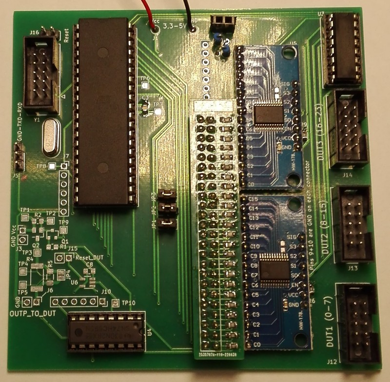

# curious-kitten-JTAG
  
*Hey kitten, find the JTAG-interface!*  


  
## What is this?
This is my version of the well-known [JTAGulator](http://www.grandideastudio.com/jtagulator/), made from scratch using different components and my own code. This repo does not (yet) contain a ready-to-use and proven tool, it is an early version and work in progress. I appreciate constructive feedback and testing, especially because i don't have a lot of targets to try my tool on.

## Licence and disclaimer
All code is licenced under AGPLv3+. The hardware (schematics, PCB-layout) is distributed under CC BY-SA 4.0. Everything is provided WITHOUT ANY WARRANTY! It is experimental stuff! Before using this tool for reverse-engineering please make sure it is legal to do so in your country. Also note that messing with unknown pins on a device can have nasty consequences, from crashes to fried silicon or even fatal explosions. As i said, **use at your own risk!**

## You need a JTAGulator? It's for sale, just buy one!
Well, the JTAGulator is certainly a really nice tool, but it is quite expensive (Parallax sells them for $189.00 as of today; Adafruit for $199.95). I wanted to make a more economic and simpler version and add some extra-features (with more or less success, read on...).

## Overview and features
The main part of this tool is an ATmega16A. It's available in DIP, has quite a few GPIOs and i had some in my parts bin. As many, many IC it is (sadly) currently unobtainium from the well-known distributors, but you can still get it on Aliexpress. The older ATmega16 without A should work fine too. Other main parts are 2 CD4067 (modules from Aliexpress) and 2 74HC595 (Aliexpress too).  

### Features/Specifications (implemented or planed)
* 24 channels
* can work with 3,3V or 5V as does your DUT (device under test). This avoids level-shifters but removes some flexibility (no 1,8V support).
* generic serial interface (115200 8N1), no special software or drivers needed on your PC
* automatic detection of IO-type (input or output, floating or with a pullup/down) to avoid driving outputs and to speed up the brute-force JTAG searching. This feature does not really work as intended for reasons i can't change. See below.
* possibility to do some basic exploration of a found JTAG-interface (number of TAP in the chain, ...) (*)
* possibility to "wiggle" several other pins while searching for JTAG in case there is some "Reset", "JTAG-enable" or other signal that need to be driven high/low to make JTAG work.
* pluggable current limiting resistors (THT parts or small extra PCB with SMD) for flexibility
* easy to make so mainly DIP, i only used SMD for a few passives because it's convenient (and 0805 is still quite easy to solder). You could redesign the entire board without any SMD-part. Using a few SMD-parts i managed to get the 2 layer PCB just under 10x10cm (-> cheap to manufacture).
* (much) cheaper than the JTAGulator. I did not do the maths but i would guess $30 or less as a ballpark figure.
* (planed) possibility to reset the DUT while searching for JTAG or doing other stuff (polarity of reset-signal configurable)
* (planed) possibility to power-cycle the DUT (MOSFET)
* (planed) monitoring of the current consumption of the DUT / overcurrent-protection

The planed features are currently not implemented but might be at some point. The PCB has spots for most of the needed components, except for the current-monitoring for which there are only testpads to connect an extra PCB. I did it this way because i was in a hurry to order the PCB and didn't had time to select an appropriate high-side current-sense IC (that would probably be unobtainium anyway...). Also selecting an "appropriate" IC to be put onto the main PCB directly is difficult (or even impossible) because there can be many different DUT, from portable stuff using microamps to big stuff using amps (or even AC or something).  

(*) Notice: This tool is not meant to be an universal JTAG-adapter, but rather a search tool. Once you identified the pins i suggest using a dedicated JTAG-adapter (i have a FT232H - beware it's 3,3V - that works great for this and other purposes) and some software like OpenOCD to read the IDENT-register (if it exists) and further mess with your DUT.

## Theory of operation
Having a copy of the schematic (`schematic.pdf`) and the code at hand while reading this part is recommanded.

### Overview/Basics
The ATmega16A is obviously the brain of the entire device. It receives commands via UART and uses a custom parser to dispatch to whatever function is wanted by the user. Each of the 24 channels is connected (via a current limiting resistor for safety) to a GPIO of the AVR. This allows the channel/pin to be an input (high-Z or with pullup) or an output. The two CD4067 are used to route the selected channel to an analog input of the internal ADC. They also allow to put a high-impedance signal (Vcc/2) on a channel for floating input detection. Because i needed a few more pins mainly to control the 4067 i added two 74HC595 with software-SPI on the AVR.
  
### IO-type identification
As said above the AVR will try to autodetect what is connected to each channel, ie
* an active (->low output impedance) digital output (or a direct connection to Vcc or GND, this is impossible to tell, just power everything off and use a multimeter in continuity mode to find Vcc/GND-pins and don't connect them to the AVR - although doing so should be safe because of the current limiting resistors)
* a floating input
* an input with a pullup to Vcc
* an input with a pulldown to GND
* some analog stuff or some variable signal that doesn't look digital (these pins will be ignored later).
#### Algorithm
The code i describe here is located in `pindir_ident.c`. It uses the following approach:
1. connect a high-impedance signal of Vcc/2 (voltage divider using 2 470k resistors) to the tested channel and measure the voltage using the internal ADC several times. If the values are fluctuating a lot the channel is probably not a digital IO -> ignore it. If the voltage is stable at around Vcc/2 we probably have a floating input. As you can see in the schematic both CD4067 have the Vcc/2-signal on a pin, so enabling *both* with the correct settings will connect Vcc/2 to the channel and also the channel to the analog input of the AVR.
2. configure the AVR-GPIO corresponding to the channel as an output, switch it to GND and then Vcc and measure the voltage once for each level. Because we could have an output of the DUT connected to the channel we need the protection resistors here to avoid blowing stuff up. If the measured voltage remains near Vcc or GND in both states we have either an active output (->low impedance) or a direct connection to Vcc/GND.
3. If the voltage drops to (almost) 0V with the AVR outputting a low-signal the channel is probably connected to an input with a pullup.
4. If the voltage goes up to (almost) Vcc while the AVR outputs a high-signal the channel is probably connected to an input with a pulldown.
#### Limitations
Obviously this approach is not perfect, for several reasons:
- Depending on the value used for the protection resistor the AVR might not be able to override a pullup/down completly, the voltage will be *somewhere between* Vcc and GND and the identification of the channel will fail. However using a too small protection resistor value could damage the DUT and/or the AVR.
- The value of pullups/pulldowns is variable between devices, it can be as low as let's say 1k or as high as let's say 470k. This makes automatic detection tricky.
- The state of a pin on the DUT can change, ie an output can be in high-Z mode when the AVR scans the channels. This is especially true for TDO on some (a lot? all?) devices if the JTAG state-machine is in reset or idle-mode where it usually will be. Optionally on some devices the TDO-pin has a pullup too.
- An output can toogle while the AVR scans the channels, in this case the AVR could report an analog pin to be ignored because the voltage changed a lot between measurements (step 1 above). *In doubt check with a scope.*  

All values used for this algorithm are configurable at compile-time (#define) and some tweaking might be needed. Sadly i don't have a lot of different devices with JTAG to test my code. I don't think there is enough space left in the AVR to make all these values *runtime*-configurable.

### Searching for JTAG
The code is in file `jtag.c`. I assume you are familiar with JTAG, if not please ask Wikipedia or a local expert or ...
#### The basic idea
Well, i did not invent anything. There are several documented tools like mine on the internet and some really useful papers and presentations available. The basic idea is always to try all possible combinations of pins/channels while sending some valid instructions/data. Precisely my tool tries to set all TAP (there might be several chained!) in BYPASS-mode (luckely this command is standardised), then clock in some known pattern on TDI and watch if it comes back on TDO.
#### Optimisations
To make things faster my code will monitor all possible outputs of the DUT *at the same time*. This can dramatically speed up things. Also the specification for JTAG recommands (or is it even mandatory?) pullups on TDI and TMS, so there is an option in the code to only consider inputs of the DUT that have these pullups as candidates for TDI and TMS.
#### Searching with pin-wiggling enabled
As i said there might be (are they actually?) some DUT that needs some inputs to be pulled high/low to enable JTAG (i would appreciate an example of a device if you know one). The current code allows you to specify the number of pins to be wiggled simultaneously (because trying all combinations on like 20 pins would take *ages* and is probably rarely if ever needed). It will then try all possible combinations on the number of specified channels while looking for JTAG on the remaining channels. To speed things up the AVR will not set pins that already have a pullup/down to high/low but skip the concerned combinations.

## Exploring the (hopefully) discovered interface
Again, i did not invent anything.
### Get number of TAP in the chain
This works because the BYPASS-instruction is mandatory and standardised and the corresponding data register is always 1 bit wide. The code will set all TAP to BYPASS, clock in a lot of '1' to all the data registers and then clock in a single '0' and count how many clock cycles it takes for this '0' to get trough the chain. 
### Get the length of the instruction register
The basic idea is the same as above. Clock in a lot of '1' to the IR, then clock in a single '0' and wait for it to come back on TDO.
### Get the lengths of the data registers
Same as above except that that *data register* is probed and this for every single possible instruction. **Dangerous, see below!**

## The serial interface / commands
The serial interface runs at 115200 8N1 with the same voltage as the AVR (3,3V or 5V - be careful to select an appropriate USB-to-UART-thingie). Each command is terminated with enter. Currently backspace does not work (might be fixed at some point) and there is no way to scroll to already tipped commands like inside a Linux-terminal (won't be implemented). By default the AVR will send back/mirror entered characters, this can be configured at compile-time (inside `main.c`).
### reset
Well, this should be clear. Reset everything, configure all channels as inputs, ...
### allinp
Configure all channels as inputs without pullup but don't forget anything else that has been configured/discovered.
### channels $nb
Set the number of used channels, from 4 to 24. Don't make this number bigger than needed because the more channels are used the slower is the search for JTAG. This command is usually the first you need to use.
### ident
Do automated IO-type identification and print summary. This command is usually the second command you want to use.  
The following characters/abbreviations are used. The directions are seen from the view of the DUT.
- `--` Channel was not probed.
- `??` Identification failed.
- `a ` Channel might be an analog voltage or something that was fluctuating during the probing.
- `d ` Channel was disabled by user.
- `I ` Floating input.
- `PU` Input with pullup resistor.
- `PD` Input with pulldown resistor.
- `O ` Output.
### chstate
Print summary of set IO-types, useful if you get lost after manual adjustments (see below).
### setmode $channel $mode
Manually set the mode of a channel. Be aware that if you use `ident` again your changes will be lost.  
$channel is a number from 0 to 23.  
$mode can be one of "disabled", "input", "inputPU" (input with pullup), "inputPD" (input with pulldown), "output". The directions are seen from the DUT, ie "output" means the channel is an output on the DUT.
### override (inputs|unknown) (yes|no)
As i said above the automated IO-type detection is far from perfect. A (currently inactive) output of the DUT will be detected as input, so sometimes you won't see any outputs on the summary (command `chstate`). However JTAG always has one output, so there must be at least one channel configured as an output on the DUT to make the JTAG-search work.  
The command `override inputs yes` tells the code to also check channels that where detected as DUT-inputs for valid data (TDO).  
The command `override unknown yes` tells the code to also consider (ie *not* ignore) channels for which the IO-type couldn't been autodetected. *This is potentially dangerous for your DUT!* Remember the disclaimer above.
### tdopullup (yes|no)
Enable the internal pullup of the AVR before checking a channel for valid TDO-data. This is needed to detect the JTAG-interface of a "naked" ATmega16A. I don't really understand this as the datasheet states that TDO is left floating but only while the state machine is not shifting data (bug in my code??). You probably don't need this but it might be worth a try if everything else fails. Note that the protection resistor must not be a too high value because this will prevent the DUT from pulling the input of the AVR low! With something like 1k it's fine, with like 47k it is not. 
### jtag1 [ignore] [dontstop]
This is the actual search-command *without* pin-wiggling. It can take up to 2 optional arguments:
- `ignore` tells the code to not consider channels/pins that don't have the mandatory(?) pullup as possible candidates for TDI and TMS. Using this option can dramatically speed up the search but it might fail if there is no pullup on TDI and/or TMS or if the autodetection (`ident`) didn't work.
- `dontstop` tells the code *not* to stop after having found a valid JTAG interface. This is useful as a sanity check, normally there should be a single JTAG-interface. If the code reports a lot of them there is something wrong, in case of a naked ATmega16A it is the pullup on TDO that is missing (use `tdopullup yes`).
### jtag2 $number_of_pins_to_wiggle [ignore]
This is the command for searching while "wiggling" the specified number of pins (try `jtag1` first and then `jtag2 1`). Optionally you can specify `ignore` as for `jtag1`, see just above.
### setlevel $channel (0/1)
Set a channel that is configured / was detected as an output to low or high. This can be used for setting needed pins found by `jtag2`.
### taps
Get the number of TAP in the chain. Will only work if a JTAG-interface has been detected by the search-functions. If it reports 0 something is wrong, check everything and maybe try `jtag1 dontstop`, see above.
### irlen
Get the length of the instruction register. Will only work if `taps` detected a single TAP.
### drlen
Get the lengths of the data registers for each instruction. Will only work if `taps` detected a single TAP and `drlen` detected a valid length (!=0). **WARNING: This can REALLY mess up your DUT as it writes to every data register without knowing the effects! Use with great caution and - i say it again - at your own risk!**

## Statistics
```
$ cloc *.c *.h
      17 text files.
      17 unique files.                              
       0 files ignored.

github.com/AlDanial/cloc v 1.86  T=0.02 s (1029.7 files/s, 113628.0 lines/s)
-------------------------------------------------------------------------------
Language                     files          blank        comment           code
-------------------------------------------------------------------------------
C                                9            296             84           1210
C/C++ Header                     8             74             44            134
-------------------------------------------------------------------------------
SUM:                            17            370            128           1344
-------------------------------------------------------------------------------
```
The ATmega16A is already quite full, not too much space left... Compiled with -O2 as we want speed but with -O3 the firmware does not fit into the available 16kB.
```
$ avr-size avr.elf
   text	   data	    bss	    dec	    hex	filename
  12748	    382	    153	  13283	   33e3	avr.elf
```

## Example output
The file `log_jtag_atmega16a.txt` contains a complete example/log while searching for the (documented but let's suppose it isn't) JTAG-interface of an ATmega16A.  
The file `log_jtag_fpga.txt` contains the same thing for some FPGA-board.
